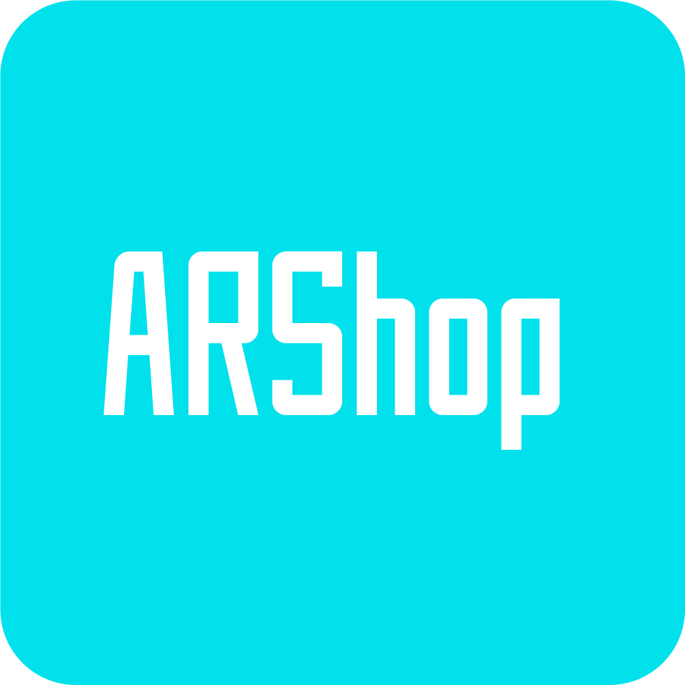

# ARShop
<!-- PROJECT LOGO -->
 

  

  <h3 align="center">ARShop</h3>

  

    Next gen shop to preview your goods!
     
  

<!-- TABLE OF CONTENTS -->

  
Table of Contents

  <ol>
    <li>
      <a href="#about-the-project">About The Project</a>
      <ul>
        <li><a href="#built-with">Built With</a></li>
      </ul>
    </li>
    <li>
      <a href="#getting-started">Getting Started</a>
      <ul>
        <li><a href="#prerequisites">Prerequisites</a></li>
        <li><a href="#installation">Installation</a></li>
      </ul>
    </li>
    <li><a href="#usage">Usage</a></li>
    <li><a href="#roadmap">Roadmap</a></li>
    <li><a href="#license">License</a></li>
    <li><a href="#contact">Contact</a></li>
    <li><a href="#acknowledgments">Acknowledgments</a></li>
  </ol>

<!-- ABOUT THE PROJECT -->
## About The Project

[![Product Name Screen Shot][product-screenshot]](https://example.com)

A comercial app (Shop) with an augmented reality preview. For customer they can preview product with augmented reality. For merchant they can scan their product into 3D object for customer to preview with augmented reality.

(<a href="#top">back to top</a>)

<!-- GETTING STARTED -->
## Getting Started

Leave it for future updates.

### Installation

Leave it for future updates.

(<a href="#top">back to top</a>)

<!-- USAGE EXAMPLES -->
## Usage

Use this space to show useful examples of how a project can be used. Additional screenshots, code examples and demos work well in this space. You may also link to more resources.  >>> Leave it for future updates.

(<a href="#top">back to top</a>)

<!-- ROADMAP -->
## Roadmap
- [x] Logo
- [ ] Registration
- [ ] Log in
- [ ] Profile
- [ ] Multi-language Support
    - [ ] English
    - [ ] Thai
### Merchant
- [ ] List and Manage the products
- [ ] Scan 2D to 3D object (Optional)
### Customer
- [ ] Browse the products
- [ ] Cart system
- [ ] Preview products with Augmented Reality
- [ ] Check out

(<a href="#top">back to top</a>)

<!-- LICENSE -->
## License

Distributed under the MIT License. See `LICENSE.txt` for more information.

(<a href="#top">back to top</a>)

<!-- CONTACT -->
## Contact

Wayu Saengphithak - myjobwayu@gmail.com

Siriphun Chojorhor - palm.181433@gmail.com

(<a href="#top">back to top</a>)

<!-- ACKNOWLEDGMENTS -->
## Acknowledgments

Leave it for future updates.

* [TEST](https://test.com)

(<a href="#top">back to top</a>)
